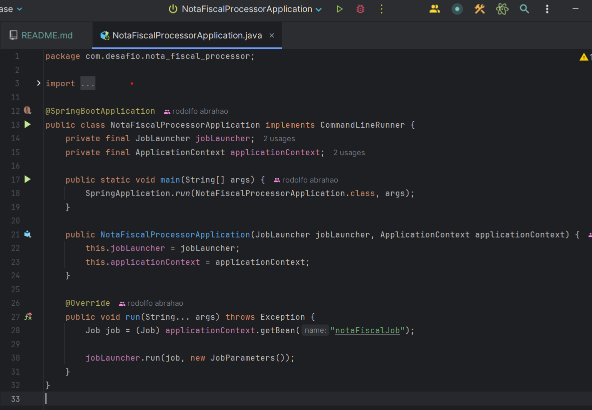

<h1>Tutorial para teste do Job Nota Fiscal Processor!</h1>

<h2>1. Clone o repositório localmente.</h2>

 Rode o seguinte comando no diretorio que você deseja clonar o projeto: 

    git clone https://github.com/Rodolfo1705/nota-fiscal-processor.git

 

<h2>2. Execute o projeto.</h2>

 Utilize uma IDE de sua preferência para rodar o Job.

Recomendação: IntelliJ IDEA.

- Encontre o arquivo 'NotaFiscalProcessorApplication'
  (nota-fiscal-processor/src/main/java/com.desafio.nota_fiscal_processor/NotaFiscalProcessorApplication.java).

 

 
- Clique em qualquer um dos ícones de 'Start'.

 

<h2>3. Verifique os arquivos de saída para testar o job. </h2>

 Localize os arquivos 'notas_validas.csv' e 'notas_invalidas.csv' na raiz do projeto.

* Caso queira testar outros cenários de notas fiscais, altere os valores no arquivo 'notas_fiscais.csv' na pasta /resources.

 

<h2> Prontinho! Teste à vontade. </h2>